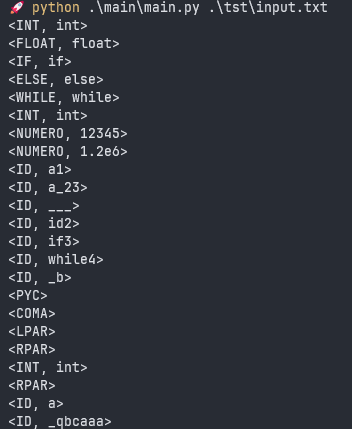
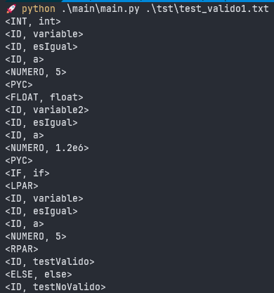
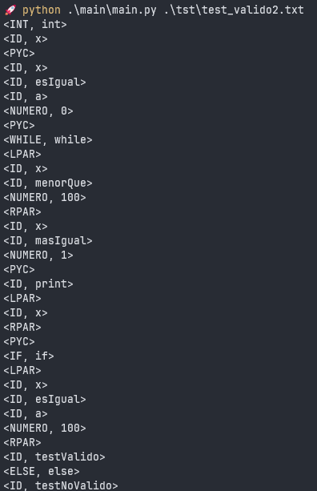
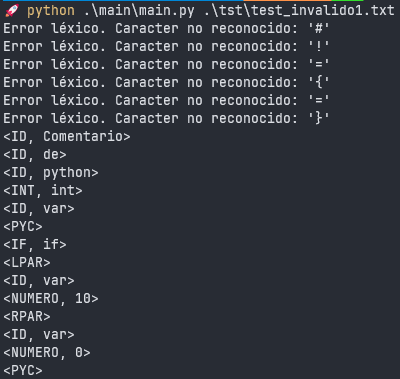

# Practica 2

Para instalar dependencias puedes hacer desde tu entorno:

```bash
pip install -r requirements.txt
```

Se intalara PLY.

Dentro de la carpeta src se encuentran dos carpetas, estas son:

- **main:** Dentro de esta carpeta encontraremos:
  - **carpeta componente:** Contiene los archivos:

    - clase_lexica.py: Enumeración que representa las clases léxicas de los componentes léxicos (tokens).

    - componente_lexico.py: Clase que representa un componente léxico (token)

  - **carpeta lexer:** Contiene el archivo:
    - scanner.py: Analizador léxico para el lenguaje.
- **tst:** Dentro de esta carpeta estaran nuestros tests que son:

  - input.txt: Este es el test prdeterminado que viene con la asignación de esta practica dandonos como resultado la salida buscada:
    

  Notemos que produce una salida que no guarda lexemas que son los únicos miembros de su clase léxica.

  - test_valido1.txt:

    > int variable esIgual a 5;
    >
    > float variable2 esIgual a 1.2e6;
    >
    > if (variable esIgual a 5)
    > testValido
    >
    > else
    >
    > testNoValido

    Veamos su salida:
    

  - test_valido2.txt:

    > int x;
    > x esIgual a 0;
    >
    > while (x menorQue 100)
    > x masIgual 1;
    > print(x);
    >
    > if (x esIgual a 100)
    > testValido
    >
    > else
    >
    > testNoValido

    Veamos la salida:
    

  - test_invalido1.txt:

    > \# Comentario de python
    >
    > int var;
    >
    > if (var != 10) {
    >
    > var = 0;
    >
    > }

    Veamos la salida de este:
    

    Veamos que una de las razones por la que es invalido es que se pasaron elementos que no reconoce nuestro lenguaje como lo pueden ser los elementos como "#" o "!".

  - test_invalido1.txt:

    > float esIgual a (10 mas 5.2) mas 3.2.3;
    >
    > oolean \_\_var esIgual a verdadero;
    >
    > if (var)
    >
    > \_\_var esIgual a falso;

    Veamos la salida:
    
    Veamos que una de las razones por las que este test es invalido es porque le pasamos un numero invalido como **3.2.3**, esto hace que tome el numero **3.2** y despues desconozca el punto siguiente ya uq eno es valido, de esta manera tenemos un caso invalido distinto al caso 1.

## Extras

1. Modificar lo necesario para producir una salida que considere no guardar lexemas que son los únicos miembros de su clase léxica.

Se modifico tanto **scanner.py** en cada función donde los lexemas son los unicos posibles de su clase léxica como **componente_lexico.py** para manejar el constructor que pueda crear objetos sin un lexema.

1. Documentar el código con las convenciones de Python.

El codigo de cada script esta documentado con las convenciones de Python.

1. Proponer 4 archivos de prueba nuevos, 2 válidos y 2 inválidos.

Los archivos de prueba propuestos estan en la carpeta tst\ junto con el archivo input.txt.


### Como ejecutar

Por ultimo, la manera de ejecutar el programa es como se solicita en la practica:

```bash
python [direccion donde esta el main] [dirección donde esta el test]
```

por ejemplo, si estas ubicado en el directorio src/, podrias hacer:

```bash
python .\main\main.py .\tst\input.txt  
```