# Practica 4

<p style="text-align:center">Rosas Marín Jesús Martín</p>

Para instalar dependencias puedes hacer desde tu entorno:

```bash
pip install -r requirements.txt
```

Se intalara PLY.

## Como ejecutar:

```bash
   python main.py prueba.txt
```

## Ejercicios

Para la gramática G = ( N, Σ, P, S), descrita por las siguientes producciones:

```
P = {
S → num S'
S' → + num S' | ε
  }
```

1.  Determinar en un archivo Readme, en formato Markdown (.md) o LaTeX (.tex) - con su respectivo PDF, para este último - , los conjuntos N, Σ y el símbolo inicial S. (0.5 pts.)

    - **No terminales (N):**

            N = {
            S,    // Simbolo inicial
            S',   // No terminal auxiliar
            }

    - **Terminales (Σ):**

            Σ = {
                '+', 'num'  // Tokens
                }

    - **Simbolo Inicial (S):**

            S = S

2.  Mostrar en el archivo la construcción de la tabla de análisis sintáctico predictivo para G. (1 pt.)

    - **First**:

            First = {
                S: {'num'},
                S': {'+', ε},
            }

    - **Follow**:

            Follow = {
                S: {'$'},
                S': {'$'},
            }

    - **Tabla de análisis sintáctico predictivo**:

      | No Terminal | num        | +             | $      |
      | ----------- | ---------- | ------------- | ------ |
      | S           | S → num S' |               |        |
      | S'          |            | S' → + num S' | S' → ε |

3.  Modificar el main.py para que nuestro programa sea capaz de recibir archivos y no sólo cadenas. (2 pts.)

    El archivo main.py fue modificado para que el programa sea capaz de recibir archivos y no só cadenas. 👍

4.  Agregar las reglas necesarias para que el Analizador Léxico (lexico.py) reconozca los terminales de G. (0.5 pts.)

    Estas son nuestras reglas para el analizador léxico:

    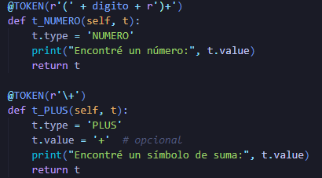

5.  Definir Σ en el enum de ClaseLexica en clase_lexica.py. (0.10 pts.)

    Se agregaron los elementos al enum ClaseLexica:

    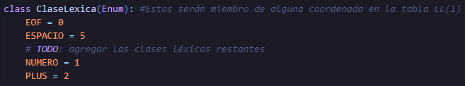

6.  Definir N en un enum de NoTerminales en clase_lexica.py. (0.10 pts.)

    Se agregaron los elementos al enum NoTerminales:

    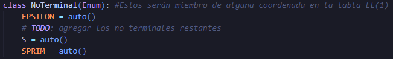

7.  Cargar N ∪ Σ en sintactico.py. (0.25 pts.)

    Se agregaron directamente los elementos a los simbolos de la gramatica, comentando la linea que creo una variable epsilon que venia en el hint del proyecto:

    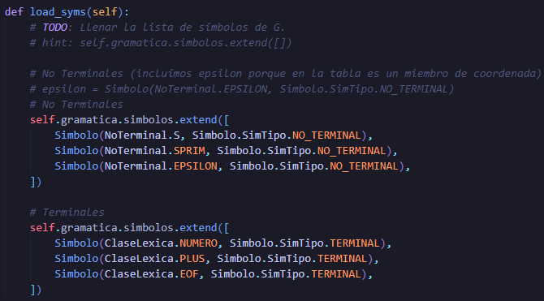

8.  Cargar P en sintactico.py. (0.25 pts.)

    Se agregaron las producciones de la gramatica:

    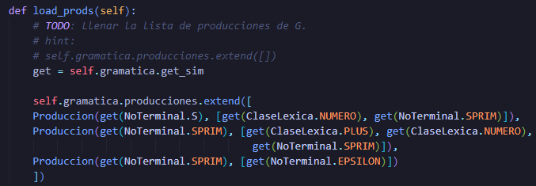

9.  Cargar la tabla de análisis sintáctico predictivo en sintactico.py. (0.25 pts.)

    Se cargo la tabla de análisis sintáctico predictivo con sus filas y columnas:

    ```python
    def load_table(self):
        # TODO: Llenar la tabla LL(1)
        # hint:
        # self.tabla[s] = {}
        # self.tabla[s][numero] = Produccion(?, [?,?,...,?])
        get = self.gramatica.get_sim


        # Inicializamos la tabla
        self.tabla = {}

        # Símbolos
        S      = get(NoTerminal.S)
        SPRIM  = get(NoTerminal.SPRIM)
        EPS    = get(NoTerminal.EPSILON)

        NUM    = get(ClaseLexica.NUMERO)
        PLUS   = get(ClaseLexica.PLUS)
        EOF    = get(ClaseLexica.EOF)

        # Producciones
        prod_S      = self.gramatica.producciones[0]  # S → NUMERO SPRIM
        prod_SPRIM1 = self.gramatica.producciones[1]  # SPRIM → PLUS NUMERO SPRIM
        prod_SPRIM2 = self.gramatica.producciones[2]  # SPRIM → ε

        # Fila S
        self.tabla[S] = {
            NUM: prod_S
        }

        # Fila SPRIM
        self.tabla[SPRIM] = {
            PLUS: prod_SPRIM1,
            EOF: prod_SPRIM2
        }
    ```

    En este caso se opto por poner el codigo directo en lugar de una foto ya que el codigo era bastante largo.

10. Implementar el algoritmo de análisis sintáctico de descenso predictivo en sintactico.py de modo que el programa acepte el archivo tst/prueba.txt e imprima las producciones necesarias para llegar de S a w; S el símbolo inicial, w la cadena de entrada. (4 pts.)

    Se implemento el algoritmo de análisis sintáctico de descenso predictivo, veamos primero nuestro algoritmo:

    ```python
    def parse(self):
        self.load_syms()
        self.load_prods()
        self.load_table()
        # TODO: Implementar el algoritmo de An. Sintáctico LL(1)

        self.an_lexico.lexer.input(self.an_lexico.lexer.lexdata)  # reiniciar entrada

        # Inicializamos
        stack = []
        get = self.gramatica.get_sim

        # Símbolos iniciales
        S = get(NoTerminal.S)
        EOF = get(ClaseLexica.EOF)

        stack.append(EOF)  # Símbolo $
        stack.append(S)

        tok = self.an_lexico.lexer.token()
        if not tok:
            self.error("Entrada vacía")
            return

        a = ClaseLexica[tok.type]  # primer token

        while len(stack) > 0:
            X = stack[-1]  # tope de la pila

            if X.tipo == X.SimTipo.TERMINAL:
                if X.sim == a:
                    stack.pop()
                    tok = self.an_lexico.lexer.token()
                    if tok:
                        a = ClaseLexica[tok.type]
                    else:
                        a = ClaseLexica.EOF
                else:
                    self.error(f"Se esperaba {X.sim.name}, pero se encontró {a.name}")
            elif X.tipo == X.SimTipo.NO_TERMINAL:
                fila = self.tabla.get(X)
                if not fila:
                    self.error(f"No hay fila para {X.sim.name}")
                produccion = fila.get(get(a))
                if not produccion:
                    self.error(f"No hay producción para [{X.sim.name}, {a.name}]")

                # Imprimir producción aplicada
                cabeza = produccion.cabeza.sim.name

                cuerpo = [s.sim.name for s in produccion.cuerpo]
                print(f"{cabeza} → {' '.join(cuerpo) if cuerpo else 'ε'}")

                stack.pop()
                # Push en orden inverso
                for simbolo in reversed(produccion.cuerpo):
                    if simbolo.sim != NoTerminal.EPSILON:
                        stack.append(simbolo)
            else:
                self.error("Símbolo desconocido en la pila")

        if a == ClaseLexica.EOF:
            print("Cadena aceptada")
        else:
            self.error("Quedaron símbolos sin analizar")
            print("Cadena rechazada")
    ```

    De esta manera podra aceptar el archivo tst/prueba.txt e imprimir las producciones para llegar de S a w, la salida se mostrara en el siguiente punto ya que ahi sera mas legible la solución.

11. Sobrescribir la función **str** de Producción para hacer más legible la impresión de las producciones necesaria para la derivación de S →\* w. (1.05 pts.)

    Veamos nuestra implementacion de ** \_\_str\_\_ **:

    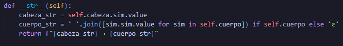

    Ahora veamos la salida de nuestro proyecto pasandole la cadena que se encuentra en el archivo tst/prueba.txt.

    Recordemos que para ejecutar el proyecto debemos hacer:

    ```bash
    python main.py prueba.txt
    ```

    Recordemos que debemos poner la ruta correctamente.

    Ahora veamos la salida:

    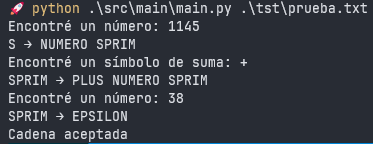

### Extras

13. Documentar el código.

    El codigo fue documentado, favor de revisar el codigo en sus respectivos archivos, las capturas puestas en este readme incluyen las funciones solicitadas pero sin su respectivo doctring para no poner capturas tan grandes, pero cada función esta documentada.

14. Proponer 4 archivos de prueba nuevos, 2 válidos y 2 inválidos.

    - **Valido 1 (archivo tst/valido1.txt):**
      Probemos con un solo numero:

      ```
      1500
      ```

      Veamos la salida:

      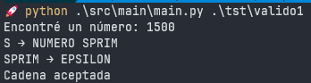

    - **Valido 2 (archivo tst/valido2.txt):**
      Probemos con una suma triple:

      ```
      3 + 4 + 5
      ```

      Veamos la salida:

      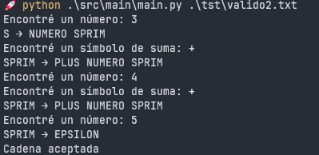

    - **Invalido 1 (archivo tst/invalido1.txt):**
      Probemos comenzando con un simbolo '+':

      ```
      + 500
      ```

      Veamos la salida:

      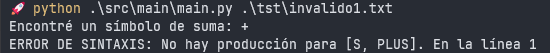

      Ya que no comienza con un numero.

    - **Invalido 2 (archivo tst/invalido2.txt):**
      Probemos terminando con un simbolo '+':

      ```
      1500 +
      ```

      Veamos la salida:

      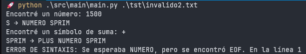

      Ya que la producción SPRIM → PLUS NUMERO SPRIM queda incompleta

15. Modificar la búsqueda de símbolos (get_sim) en la clase Gramatica para hacerla más eficiente en tiempo. Es válido cambiar la implementación de la clase o de la práctica en general para lograrlo.

     get_sim usaba una busqueda lineal para encontrar el simbolo deseado, ahora usamos un diccionarion para buscar el simbolo deseado en O(1).

     veamos los cambios en el archivo gramatica.py:

     ```python
     class Gramatica:
    def __init__(self):
        self.simbolos: List[Simbolo] = []
        self.producciones: List[Produccion] = []
        self.simbolos_dict: Dict[Enum, Simbolo] = {}  # NUEVO: para acceso rápido

    def add_sim(self, simbolo: Simbolo):
        if simbolo.sim not in self.simbolos_dict:  # NUEVO: para acceso rápido
            self.simbolos.append(simbolo)
            self.simbolos_dict[simbolo.sim] = simbolo

    def add_prod(self, produccion: Produccion):
        self.producciones.append(produccion)

    def get_sim(self, clave: Enum) -> Simbolo:  # NUEVO
        if clave in self.simbolos_dict: # buscar en el diccionario
            return self.simbolos_dict[clave]
        raise Exception(f"No existe un símbolo en la gramática con ese valor: {clave}")

    def get_prod(self, idx: int) -> Produccion:
        return self.producciones[idx]
     ```

     Tambien cambiamos en el archivo sintactico.py, principalmente la función load_syms() para que en lugar de usar lista.extend() usemos add_sim():

     ```python
     # No Terminales
        self.gramatica.add_sim(Simbolo(NoTerminal.S, Simbolo.SimTipo.NO_TERMINAL))
        self.gramatica.add_sim(Simbolo(NoTerminal.SPRIM, Simbolo.SimTipo.NO_TERMINAL))
        self.gramatica.add_sim(Simbolo(NoTerminal.EPSILON, Simbolo.SimTipo.NO_TERMINAL))

        # Terminales
        self.gramatica.add_sim(Simbolo(ClaseLexica.NUMERO, Simbolo.SimTipo.TERMINAL))
        self.gramatica.add_sim(Simbolo(ClaseLexica.PLUS, Simbolo.SimTipo.TERMINAL))
        self.gramatica.add_sim(Simbolo(ClaseLexica.EOF, Simbolo.SimTipo.TERMINAL))
     ```

     Esta solución es mas optima que la anterior y nos devuelve el mismo resultado.