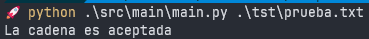
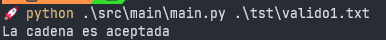
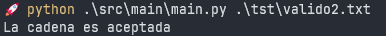
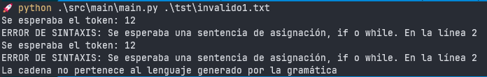
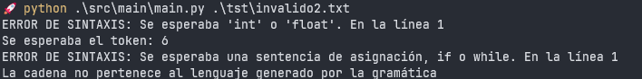

# Practica 3

Para instalar dependencias puedes hacer desde tu entorno:

```bash
pip install -r requirements.txt
```

Se intalara PLY.

Para ejecutar nuestro programa debemos ejecutar:
```bash
python .\src\main\main.py .\tst\prueba.txt
```
 
si es que estas parado en la carpeta raiz del proyecto.

## Ejercicio

Para la gramática G = ( N, Σ, P, S), descrita por las siguientes producciones:

    P = {

    programa → declaraciones sentencias
    declaraciones → declaraciones declaracion | declaracion
    declaracion → tipo lista-var ;
    tipo → int | float
    lista_var → lista_var , identificador | identificador
    sentencias → sentencias sentencia | sentencia
    sentencia → identificador = expresion ; | if ( expresion ) sentencias else sentencias | while ( expresión ) sentencias
    expresion → expresion + expresion | expresion - expresion | expresion * expresion | expresion / expresión | identificador | numero
    expresion → ( expresion )
    }

1. Determinar en un archivo Readme, en formato Markdown (.md) los conjuntos N, Σ y el símbolo inicial S. (0.5 pts.)

    - **No terminales (N):**

            N = {
            programa,
            declaraciones,
            declaracion,
            tipo,
            lista_var,
            sentencias,
            sentencia,
            expresion
            }
    - **Terminales (Σ):**

            Σ = {
                'int', 'float',            // Tipo
                ';', ',', '=', '(', ')',   // Símbolos
                'if', 'else', 'while',     // Palabras reservadas
                '+', '-', '*', '/',        // Operadores
                'identificador', 'numero'  // Tokens
                }
    - **Simbolo Inicial (S):**

            S = programa

2. Mostrar en el archivo el proceso de eliminación de ambigüedad o justificar, en caso de no ser necesario.

    Notemos que la ambigüedad en esta gramática esta en la regla de expresion, ya que la producción no especifica una jerarquía de operadores ni asociatividad, lo que puede generar múltiples árboles de derivación para la misma expresión.

    Ahora, lo que podemos hacer es acomodar cada operador de menor a mayor precedencia, de tal manera que nos queda:

    1. suma y resta
    2. multiplicación y división
    3. parentesis

    Por lo que podemos quitar la ambiguedad de la siguiente manera:
    
        expresion → expresion + expresion_mult | expresion - expresion_mult | expresion_mult
        expresion_mult → expresion_mult * expresion_unaria | expresion_mult / expresion_unaria | expresion_unaria
        expresion_unaria → ( expresion ) | identificador | numero

    Por lo que nuestra o completa quedaria: 


        programa → declaraciones sentencias
        declaraciones → declaraciones declaracion | declaracion
        declaracion → tipo lista-var ;
        tipo → int | float
        lista_var → lista_var , identificador | identificador
        sentencias → sentencias sentencia | sentencia
        sentencia → identificador = expresion ; |
                 if ( expresion ) sentencias else sentencias | 
                 while ( expresion ) sentencias
        expresion → expresion + expresion_mult | expresion - expresion_mult | expresion_mult
        expresion_mult → expresion_mult * expresion_unaria | expresion_mult / expresion_unaria | expresion_unaria
        expresion_unaria → ( expresion ) | identificador | numero


3. Mostrar en el archivo el proceso de eliminación de la recursividad izquierda o justificar, en caso de no ser necesario.

     Veamos que tenemos recursión izquierda en las siguientes reglas:
     
     - declaraciones
     - lista_var
     - sentencias
     - expresion
     - expresion_mult

     Asi que eliminemos esa recursión del tipo A -> A α | β
        
        programa → declaraciones sentencias
        declaraciones → declaracion declaraciones'
        declaraciones' → declaracion declaraciones' | ε
        declaracion → tipo lista-var ;
        tipo → int | float
        lista_var → identificador lista_var'
        lista_var' → , identificador lista_var' | ε
        sentencias → sentencia sentencias'
        sentencias' → sentencia sentencias' | ε
        sentencia → identificador = expresion ; 
                | if ( expresion ) sentencias else sentencias
                | while ( expresion ) sentencias
        expresion → expresion_mult expresion'
        expresion' → + expresion_mult expresion' | - expresion_mult expresion' | ε
        expresion_mult → expresion_unaria expresion_mult'
        expresion_mult' → * expresion_unaria expresion_mult' | / expresion_unaria expresion_mult' | ε
        expresion_unaria → ( expresion ) | identificador | numero


4. Mostrar en el archivo el proceso de factorización izquierda o justificar, en caso de no ser necesario.

    Notemos que no es necesario ya que la factorización izquierda nos dice que si tenemos una regla  A -> αβ1 | αβ2 lo podemos convertir a A -> αA', A' -> β1 | β2

    Pero veamos que en nuestras reglas que nos manden a diferentes no terminales ademas de que no hay prefijos comunes. Por lo tanto, no se requiere factorización en ninguna regla.

5. Mostrar en el archivo los nuevos conjuntos N y P.

    Por lo tanto nuestro nuevo conjunto N es:

       N = { 
        programa, 
        declaraciones, 
        declaraciones', 
        declaracion, 
        tipo, 
        lista_var, 
        lista_var', 
        sentencias, 
        sentencias', 
        sentencia, 
        expresion, 
        expresion', 
        expresion_mult, 
        expresion_mult', 
        expresion_unaria 
        }

    y nuestro conjunto P es:

        programa → declaraciones sentencias
        declaraciones → declaracion declaraciones'
        declaraciones' → declaracion declaraciones' | ε
        declaracion → tipo lista_var ;
        tipo → int | float
        lista_var → identificador lista_var'
        lista_var' → , identificador lista_var' | ε
        sentencias → sentencia sentencias'
        sentencias' → sentencia sentencias' | ε
        sentencia → identificador = expresion ; | if ( expresion ) sentencias else sentencias | while ( expresion ) sentencias
        expresion → expresion_mult expresion'
        expresion' → + expresion_mult expresion' | - expresion_mult expresion' | ε
        expresion_mult → expresion_unaria expresion_mult'
        expresion_mult' → * expresion_unaria expresion_mult' | / expresion_unaria expresion_mult' | ε
        expresion_unaria → ( expresion ) | identificador | numero

6. Modificar el main.py para que nuestro programa sea capaz de recibir archivos y no sólo cadenas. 

    Se modifico el main.py para que acepte archivos, principalmente con las instrucciones:

    ```py
    # Cuando se ejecuta el script, se espera que reciba un archivo como argumento
    if __name__ =="__main__":
        if len(sys.argv) == 2:
            with open(sys.argv[1],"r") as file:
            data = file.read() # Lee el contenido del archivo
    ```

    De esta manera cuando se ejecute el archivo por terminal se esperara un argumento, este sera nuestro archivo .txt.

    Para mejor visualizacipon vease el archivo main.py

7. Implementar el Analizador Sintáctico (analisis/sintactico.py) de descenso recursivo, documentando las funciones de cada No-Terminal, de forma que el programa descrito en el archivo tst/prueba.txt sea reconocido y aceptado por el analizador resultante. 

    Se implemento el analizador Sintáctico de descenso recursivo para que reconozca el archivo tst/prueba.txt, aqui un breve resumen de lo implementado:

    Se uso como base el codigo de la practica 2.

    - El Analizador Sintactico de descenso recursivo esta implementado y documentado  en analisis/sintactico.py, ademas de venir con el conjunto P comentado para su mejor visualización y entendimiento.

    - Se agregaron las siguientes clases lexicas a clase_lexica.py:
        1. IGUAL = 12  # =
        2. SUMA = 13   # +
        3. RESTA = 14  # -
        4. MULT = 15   # *
        5. DIV = 16    # /

    - Por cada clase nueva, se implemento su regla correspondiente en lexico.py

    Para mejor visualización de la implementación vea:
        - analisis/sintactico.py
        - analisis/lexico.py
        - componente/clase_lexica.py

    Ahora hagamos la prueba con el archivo de prueba:

    Veamos primero el archivo:

        int a, _b;
        float c, d;

        a = 1 + 3;
        _b = a + 23;

    Ahora probemoslo con nuestra implementación:

    

## Extras

9. Documentar TODO el código.

    Todo el codigo implentado fue documentado, esto incluye:
    - main.py
    - analisis/sintactico.py
    - analisis/lexico.py
    - componente/clase_lexica.py

10. Proponer 4 archivos de prueba nuevos, 2 válidos y 2 inválidos.

    Propongamos los siguientes archivos de prueba:
     
     - Archivo valido 1:

            int a;
            float b;
            int c;

            a = 1 + 3;
            b = a * 3;
            c = ( a ) + ( b );

        Veamos la salida:

        
    
    - Archivo valido 2:

            int x;
            x = 5;
            if ( x ) x = 3; else x = 4;

        Veamos la salida:

        

    - Archivo Invalido 1:

            int x;
            if (x = 1
                x = 2;
            else
                x = 3;

        Veamos que hay un if mal formado, veamos la salida:

        

    - Archivo Invalido 2:

            x 5;

        Veamos que no declaramos ni el tipo ni pusimos el simbolo de asignación:

        Ahora veamos la salida:

        


